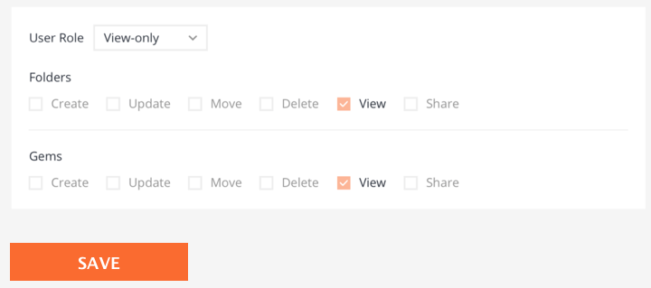

# Component
Estimated task time 4h. (possibly more or less). Please commit gradually to see progress of task completion.

Main objective:

Make component with UI shown above. Inside dropdown should have:
 - Dropdown predefined values (User, Member, Admin) + "Custom" role
 - Changed predefined values(User, Member, Admin) in dropdown will update state of checkboxes to different values
    - All predefined roles will have no possibility(read-only) to change values of checkboxes
 - Selecting "Custom" role will allow to set any positions of checkboxes
    - Default state: all checkboxes unchecked

Role examples:
- Admin - all checkboxes enabled
- User - can't move/delete gems and folders
- Member - can only view and share gems and folders

Goals:
- [ ] Make checkboxes(images inside [materials folder](/materials)) and dropdowns components (without native select, checkbox and without UI Frameworks)
- [ ] Callback on changing user role(dropdown) will return current role and checkbox state
- [ ] On save return current value with role and checkbox state


Bonus points:
- [ ] Simple responsive (not over the head but not broken)
- [ ] Component covered with unit/integration tests
- [ ] Readable and understandable types(TS)
- [ ] Dev docs - how to use component (as it like npm module)
- [ ] Build - script to minified lib version

## Install

```
$ yarn add @shelf/xxxxxx
```

## Usage

```js
const {getFoo} = require('@shelf/xxxxxx');

getFoo();
```

## Publish

```sh
$ git checkout master
$ yarn version
$ yarn publish
$ git push origin master --tags
```

## License

MIT © [Shelf](https://shelf.io)
